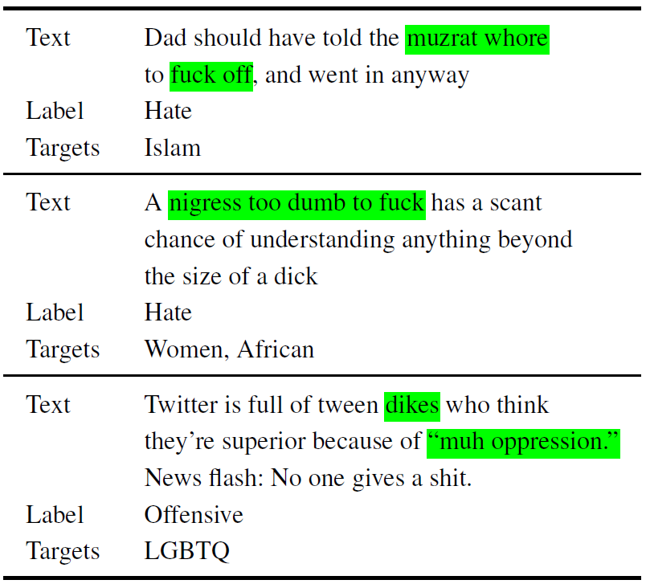

# 11711 Assignment 3 : HateXplain: A Benchmark Dataset for Explainable Hate Speech Detection 

Contributors: Arvind Subramaniam, Aryan Mehra and Sayani Kundu

### In this repository, we replicate (and soon build upon) the results of the following paper: 

"[HateXplain: A Benchmark Dataset for Explainable Hate Speech Detection](https://arxiv.org/abs/2012.10289)". 
<!-- Please follow this [link] "" for the repo to the main paper.  -->

------------------------------------------
***Folder and File Description*** :open_file_folder:	
------------------------------------------
~~~

./Data                                  --> Contains the dataset related files.
./Models                                --> Contains the codes for all the classifiers used
./Preprocess  	                   --> Contains the codes for preprocessing the dataset	
./best_model_json                       --> Contains the parameter values for the best models
./Experiments.ipynb                     --> Contains the codes for all the metrics (performance, bias and Explainability) using BERT
./model_explain_output_100.json         --> The explainability output log file for lambda = 100 (attention constant)
./model_explain_output_0point001.json   --> The explainability output log file for lambda = 0.001 (attention constant)
~~~

------------------------------------------
***Saved Models*** 
------------------------------------------
Due to the large size of the saved models folder, we have shared a drive link to access the same [here] "". The folder structure is as follows:
```
Saved
└── bert-base-uncased_11_6_3_0.001
       ├── config.json
       ├── pytorch_model.bin
       ├── special_tokens_map.json  
       ├── tokenizer_config.json
       └── vocab.txt
       
       
└── bert-base-uncased_11_6_3_1
       ├── config.json
       ├── pytorch_model.bin
       ├── special_tokens_map.json  
       ├── tokenizer_config.json
       └── vocab.txt    
       
└── bert-base-uncased_11_6_3_10
       ├── config.json
       ├── pytorch_model.bin
       ├── special_tokens_map.json  
       ├── tokenizer_config.json
       └── vocab.txt     
       
└── bert-base-uncased_11_6_3_100
       ├── config.json
       ├── pytorch_model.bin
       ├── special_tokens_map.json  
       ├── tokenizer_config.json
       └── vocab.txt 
```
------------------------------------------
***Types of Experiments*** 
------------------------------------------
We report three types of metrics for the BERT model:

Performance - Accuracy, F1 score and AUROC.
Bias        - GMB-Subgroup-AUC, GMB-BPSN-AUC and GMB-BNSP-AUC.
Explainability
     ├── Plausibility - IOU F1, Token F1 and AUPRC.
     └── Faithfulness - Comprehensiveness and Sufficiency.
     

# Abstract

Hate speech is a challenging issue plaguing the online social media. While better models for hate speech detection are continuously being developed, there is little research on the bias and interpretability aspects of hate speech. In this work, we introduce HateXplain, the first benchmark hate speech dataset covering multiple aspects of the issue. Each post in our dataset is annotated from three different perspectives: the basic, commonly used 3-class classification (i.e., hate, offensive or normal), the target community (i.e., the community that has been the victim of hate speech/offensive speech in the post), and the rationales, i.e., the portions of the post on which their labelling decision (as hate, offensive or normal) is based. We utilize existing state-of-the-art models and observe that even models that perform very well in classification do not score high on explainability metrics like model plausibility and faithfulness. We also observe that models, which utilize the human rationales for training, perform better in reducing unintended bias towards target communities. 

***WARNING: The repository contains content that are offensive and/or hateful in nature.***

<p align="center"></p>

------------------------------------------
***Table of contents*** :bookmark_tabs:
------------------------------------------

:bookmark: [**Dataset**](Data/README.md) :- This describes the dataset format and setup for the dataset pipeline.

:bookmark: [**Parameters**](Parameters_description.md) :- This describes all the different parameter that are used in this code

------------------------------------------
***Usage instructions*** 
------------------------------------------
Please setup the **Dataset** first. Install the corresponding version of tensorflow (listed below) to avoid version conflicts. Next, install the required libraries using the following command (preferably inside an environemt)
~~~
pip install tensorflow==2.4.0
pip install -r requirements.txt
~~~
------------------------------------------
***Training*** 
------------------------------------------
To train the model use the following command.
~~~
usage: manual_training_inference.py [-h]
                                    --path_to_json --use_from_file
                                    --attention_lambda

Train a deep-learning model with the given data

positional arguments:
  --path_to_json      The path to json containining the parameters
  --use_from_file     whether use the parameters present here or directly use
                      from file
  --attention_lambda  required to assign the contribution of the atention loss

~~~
You can either set the parameters present in the python file, option will be (--use_from_file set to True). To change the parameters, check the **Parameters** section for more details. The code will run on CPU by default. The recommended way will be to copy one of the dictionary in `best_model_json` and change it accordingly.

* **For transformer models** :-The repository current supports the model having similar tokenization as [BERT](https://huggingface.co/transformers/model_doc/bert.html). In the params set `bert_tokens` to True and `path_files` to any of BERT based models in [Huggingface](https://huggingface.co/). 

------------------------------------------
***Bias Calculation Script*** 
------------------------------------------


------------------------------------------
***Explainability Calculation Script*** 
------------------------------------------


------------------------------------------
***Future Work for Assignment 4*** 
------------------------------------------
- [ ] Add other Transformers model to the pipeline.
